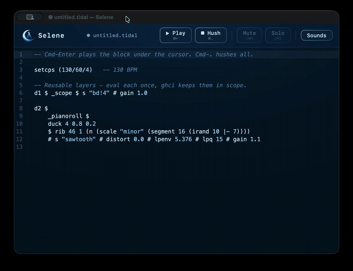

<p align="center">
  
  <h1 align="center">Selene</h1>
</p>

<p align="center">
  A single-installer live-coding music environment.<br>
      Simple. Declarative. Music as code.
</p>

<p align="center">
  <a href="https://github.com/anbclausen/selene/releases/latest"></a>
</p>

<p align="center">
  <a href="LICENSE"></a>
  
  
  
</p>

---

## Showcase

<p align="center">
  
</p>

## What it is

Selene is a desktop app for composing music declaratively in Haskell. You describe patterns, rhythms, and harmony as code, and hear them instantly. Under the hood it runs [TidalCycles](https://tidalcycles.org/), all bundled into a single installer.

No terminal. No package managers. No configuration. Open the app and start playing.

Selene is a **superset of TidalCycles**: every Tidal pattern works unchanged, plus a handful of Selene-specific helpers for arrangement and visuals (see below).

> **Alpha.** Selene is young and moving fast. Expect rough edges, breaking changes between releases, and the occasional bug. If you hit one, [open an issue](https://github.com/anbclausen/selene/issues/new).

## Install

1. Download the `.dmg` from the [latest release](https://github.com/anbclausen/selene/releases/latest) and drag Selene into Applications.
2. First launch: the app is not code-signed yet, so macOS reports it as "damaged". Clear the quarantine flag once, then open normally:
   ```sh
   xattr -cr /Applications/Selene.app
   ```
3. On first run Selene downloads its audio runtime and sample library (~630 MB total — the installer itself stays small). After that it works fully offline.

Requirements: an Apple Silicon Mac (M1 or newer). Intel Macs, Windows, and Linux are on the roadmap.

## Getting started

Type a pattern into the editor and evaluate it (Cmd-Enter). That's the whole loop.

```haskell
d1 $ sound "bd*4"
```

Layer, transform, and arrange from there:

```haskell
resetCycles
d1 $ arrange
  [ (0, 16, sound "bd*4")
  , (8, 16, _pianoroll $ n "0 2 4 7" # sound "arpy")
  ]
d2 $ _scope $ sound "bd*4"
```

New to TidalCycles? The [Tidal userbase docs](https://tidalcycles.org/docs/) cover the pattern language.

## Selene-specific functions

Everything that isn't stock Tidal. Visual markers are prefixed with `_` (Strudel-style) and are pure passthroughs — they never change the sound.

| Function | What it does |
| --- | --- |
| `arrange [(start, end, pattern), …]` | Lay patterns on a looping timeline so a track builds up over cycles (alias for `seqPLoop`). `resetCycles` restarts it from the top; the editor shows the total length. |
| `_pianoroll` | Show a scrolling piano roll for this channel — fixed centre playhead, past on the left, near-future on the right. |
| `_scope` | Show this channel's waveform (oscilloscope). |
| `duck n depth attack pattern` | Sidechain-style gain pump. Dips this pattern's gain to the floor `n` times per cycle and ramps back (`depth` 0..1 = dip amount, `attack` 0..1 = fraction of each pulse spent recovering, so smaller = snappier). An approximation of Strudel's `duck` — Tidal can't sidechain across orbits, so apply it to the layer you want ducked (bass/pads), not the kick. |
| `sawtooth` / `pulse` | Plain oscillator synths (`s "sawtooth"`, `s "pulse"`), filling the gap where SuperDirt ships `supersaw` but no bare saw/pulse. |
| `fm` / `fmh` / `lpenv` | Raw SuperDirt params (`pF` passthroughs) for FM index, FM harmonic ratio, and filter-envelope amount — the Strudel names, absent from stock Tidal. |
| `time` | Continuous signal of absolute cycle time (Strudel's `time`). Sweep a param as the track runs, e.g. `# fm time`. |
| `beat i n` | Play only on step `i` of an `n`-step cycle (Strudel `beat`). `beat 2 32` hits step 2 of 32. |
| `rib start len` | Freeze a `len`-cycle window from cycle `start` and loop it forever (Strudel `rib`/ribbon). `rib 46 1` pins one cycle of an otherwise per-cycle-random pattern. |

## Why

Writing music in Haskell normally means installing a Haskell toolchain, SuperCollider, SuperDirt, and wiring them together by hand. Selene ships everything preconfigured, so you can focus on the music instead of the setup.

## Known limitations (alpha)

- Apple Silicon macOS only. Intel/Windows/Linux builds don't exist yet.
- The app is unsigned — first launch needs `xattr -cr /Applications/Selene.app`.
- First launch needs a network connection (it fetches the audio runtime and samples, ~630 MB).
- No recording/export yet; it's on the roadmap.

## Contributing

Selene is community-driven. Fork it, build something, open a PR; improvements to the editor, the helper library, the visuals, or platform support are all welcome.

Have an idea or hit a rough edge? Open a [feature request](https://github.com/anbclausen/selene/issues/new) and let's talk about it.

### Building from source

Requires Rust, [GHCup](https://www.haskell.org/ghcup/) (for cabal), and the [Tauri v2 prerequisites](https://v2.tauri.app/start/prerequisites/).

```sh
cargo tauri dev
```

GHC 9.6.7 and tidal 1.9.4 are fetched and vendored automatically on first run.

## Acknowledgements

Selene stands on the shoulders of these projects — it bundles or downloads them
unmodified, and their source is available at the links:

- [TidalCycles](https://github.com/tidalcycles/Tidal) (GPL-3.0) — the pattern engine.
- [SuperCollider](https://github.com/supercollider/supercollider) (GPL-3.0) — the sound server.
- [SuperDirt](https://github.com/musikinformatik/SuperDirt) (GPL-2.0) — the sampler/synth framework.
- [sc3-plugins](https://github.com/supercollider/sc3-plugins) (GPL-2.0+) — extra UGens.
- [GHC](https://www.haskell.org/ghc/) (BSD-style) — the Haskell runtime.
- [Dirt-Samples](https://github.com/tidalcycles/Dirt-Samples) — the default sample library, downloaded from upstream on first run (never redistributed by Selene).

Several helper functions and the visual style are inspired by
[Strudel](https://strudel.cc) — reimplemented for Tidal, no Strudel code is used.

Selene is an independent project, not affiliated with or endorsed by the
TidalCycles, Strudel, or SuperCollider projects.

## License

GPL-3.0, see [LICENSE](LICENSE).
