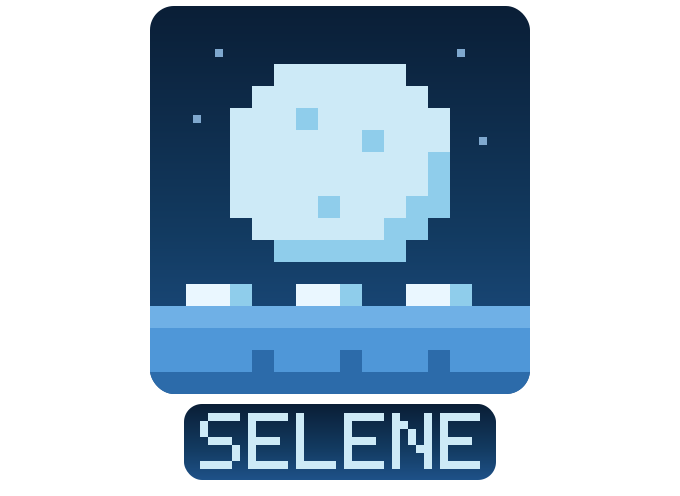

<p align="center">
  
</p>

<h1 align="center">Selene</h1>

<p align="center">
  A single-installer live-coding music environment.<br>
  Download. Launch. Make music.
</p>

<p align="center">
  <a href="LICENSE"></a>
  
</p>

---

## What it is

Selene bundles [TidalCycles](https://tidalcycles.org/), [SuperDirt](https://github.com/musikinformatik/SuperDirt), and a live editor with audio-reactive visuals ([Hydra](https://hydra.ojack.xyz/)) into one desktop installer. No terminal. No Haskell toolchain. No manual SuperCollider setup.

Stock Tidal installation requires ghcup, cabal, SuperCollider, SuperDirt, boot configs, and luck. Selene ships all of it.

## How it works

```
Launch app
  ├─ sclang → startup.scd → boots scsynth + SuperDirt  (OSC :57120)
  ├─ ghci (bundled GHC + tidal) → BootTidal.hs → Tidal ready
  └─ editor (CodeMirror in webview)
       eval block → Tauri IPC → ghci → Tidal → OSC → SuperDirt → sound
       p5.js taps audio bus → visuals
```

Tauri (Rust) is the outer shell. GHC, sclang/scsynth, and SuperDirt ship as bundled sidecar binaries inside the installer.

## Stack

| Layer    | Tech                                      |
|----------|-------------------------------------------|
| Shell    | Tauri / Rust                              |
| Pattern  | TidalCycles / Haskell                     |
| Sound    | SuperCollider + SuperDirt                 |
| Editor   | CodeMirror                                |
| Visuals  | p5.js                                     |
| Samples  | [Clean-Samples](https://github.com/tidalcycles/Clean-Samples) |

## Status

Early development. Not yet functional end-to-end. See [TODO.md](TODO.md) for current work.

## License

GPL-3.0 — see [LICENSE](LICENSE).

Upstream notices: TidalCycles (GPL-3), SuperDirt (GPL-3), SuperCollider (GPL-3), Clean-Samples (CC0), p5.js (MIT).
